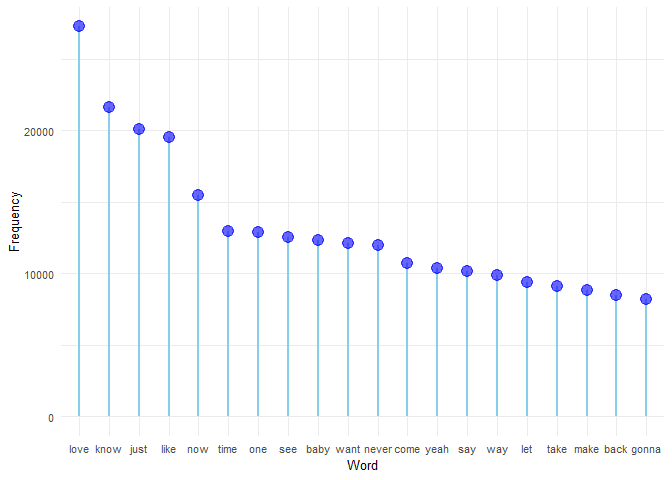
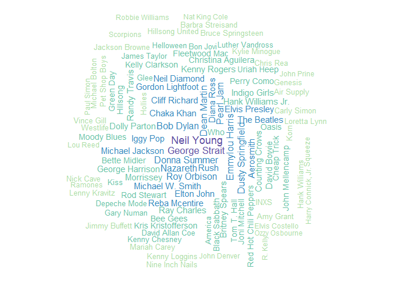
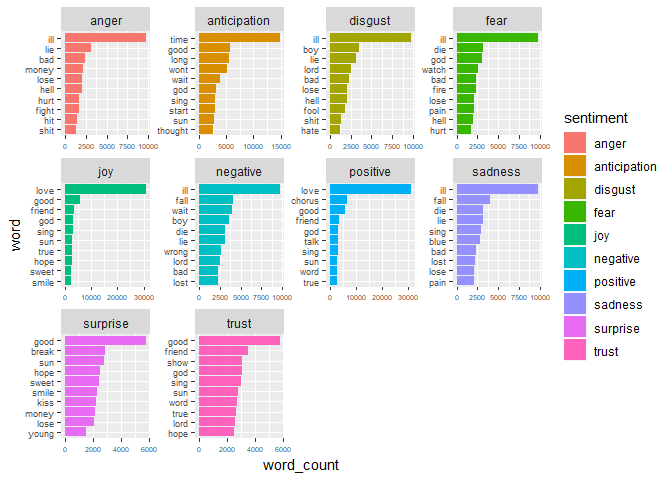
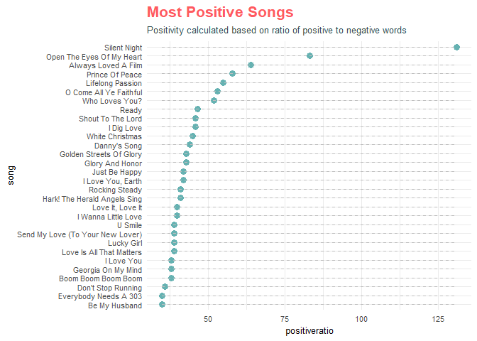
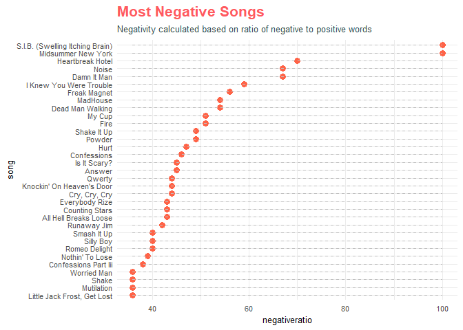
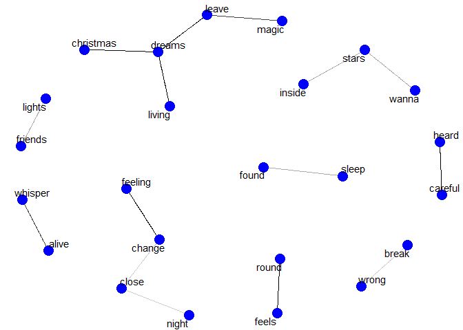

## Text Mining and Sentiment Analysis of English  Song Lyrics{.tabset .tabset-fade}


### Introduction {.tabset .tabset-fade .tabset-pills}


*****************************************************************

**What are we doing?**

******************************************************************
In this exercise we have used some Text mining and Sentiment analysis packages available in R to derive key insights from the lyrics dataset obtained from Kaggle. The aspects analyzed are as follows.  

* Who are the artists with the most number of songs?
* What are artists singing about?
* How long are the songs?
* What sentiments do the songs evoke?
* What words appear together in the songs written by the Killers?  
  
  
********************************************************************  

**Data**  

********************************************************************  

The data was obtained from Kaggle. There was some amount of cleaning already done on the data in the form of removing inconvenient data like removing non-English lyrics, extremely short, extremely long lyrics and lyrics with non-ASCII symbols. The original data contains lyrics for 57650 songs. We have used the entire dataset for text mining, however used only 30% of the songs for sentiment analysis
  
  The dataset contains 4 variables:  
  
Variable | Desctiption  
-------- | -----------  
ARTIST   | Name of the artist  
SONG     | Name of the song  
LINK     | It is a link to a webpage containing the song  
LYRICS   | It is the lyrics of the song identified in the song column

********************************************************************

**Packages Required**

********************************************************************

Following are the packages required to analyse the given datasets:


* `readr` - It provides a fast and friendly way to read rectangular (csv, tsv) data 
* `dplyr` - dplyr provides verbs that helps in data manipulation of objects like data frame
* `tidyr` - It is designed specifically for data tidying and works well with 'dplyr' data pipeline
* `stringr` - It is used for character manipulation, pattern matching in strings, etc.
* `tm` - A framework for text mining applications within R.
* `plotly` - plotly is used for creating interactive webpages in R
* `qdap` - package designed to assist in quantitative discourse analysis
* `SnowballC` - for word stemming
* `widyr` -  package wraps the pattern of un-tidying data into a wide matrix
* `quanteda` - Provides functionality for corpus management,creating and 
               manipulating tokens and ngrams
* `knitr` - knitr is used for dynamic report generation
* `wordcloud` - To create a frequent wordcloud
* `tidytext` - create texts in a tidy format
* `ggraph` - to create graphs 
* `igraph` - to handle large graphs, with millions of vertices and edges


 
******************************************************************

### Analysis {.tabset .tabset-fade .tabset-pills}


**Analysis**

******************************************************************

Firstly, we shall read the data from the .csv file provided. We can see a glimpse of the table below i.e artist, song, link, text. The below table shows the title, link and lyrics to two of the Songs from the Swedish pop group ABBA.
  
  

<!--html_preserve--><div id="htmlwidget-231515a277925305bac1" style="width:100%;height:auto;" class="datatables html-widget"></div>
<script type="application/json" data-for="htmlwidget-231515a277925305bac1">{"x":{"filter":"none","data":[["1","2"],["ABBA","ABBA"],["Ahe's My Kind Of Girl","Andante, Andante"],["/a/abba/ahes+my+kind+of+girl_20598417.html","/a/abba/andante+andante_20002708.html"],["Look at her face, it's a wonderful face  \nAnd it means something special to me  \nLook at the way that she smiles when she sees me  \nHow lucky can one fellow be?  \n  \nShe's just my kind of girl, she makes me feel fine  \nWho could ever believe that she could be mine?  \nShe's just my kind of girl, without her I'm blue  \nAnd if she ever leaves me what could I do, what could I do?  \n  \nAnd when we go for a walk in the park  \nAnd she holds me and squeezes my hand  \nWe'll go on walking for hours and talking  \nAbout all the things that we plan  \n  \nShe's just my kind of girl, she makes me feel fine  \nWho could ever believe that she could be mine?  \nShe's just my kind of girl, without her I'm blue  \nAnd if she ever leaves me what could I do, what could I do?\n\n","Take it easy with me, please  \nTouch me gently like a summer evening breeze  \nTake your time, make it slow  \nAndante, Andante  \nJust let the feeling grow  \n  \nMake your fingers soft and light  \nLet your body be the velvet of the night  \nTouch my soul, you know how  \nAndante, Andante  \nGo slowly with me now  \n  \nI'm your music  \n(I am your music and I am your song)  \nI'm your song  \n(I am your music and I am your song)  \nPlay me time and time again and make me strong  \n(Play me again 'cause you're making me strong)  \nMake me sing, make me sound  \n(You make me sing and you make me)  \nAndante, Andante  \nTread lightly on my ground  \nAndante, Andante  \nOh please don't let me down  \n  \nThere's a shimmer in your eyes  \nLike the feeling of a thousand butterflies  \nPlease don't talk, go on, play  \nAndante, Andante  \nAnd let me float away  \n  \nI'm your music  \n(I am your music and I am your song)  \nI'm your song  \n(I am your music and I am your song)  \nPlay me time and time again and make me strong  \n(Play me again 'cause you're making me strong)  \nMake me sing, make me sound  \n(You make me sing and you make me)  \nAndante, Andante  \nTread lightly on my ground  \nAndante, Andante  \nOh please don't let me down  \n  \nMake me sing, make me sound  \n(You make me sing and you make me)  \nAndante, Andante  \nTread lightly on my ground  \nAndante, Andante  \nOh please don't let me down  \nAndante, Andante  \nOh please don't let me down\n\n"]],"container":"<table class=\"cell-border stripe\">\n  <thead>\n    <tr>\n      <th> <\/th>\n      <th>artist<\/th>\n      <th>song<\/th>\n      <th>link<\/th>\n      <th>text<\/th>\n    <\/tr>\n  <\/thead>\n<\/table>","options":{"order":[],"autoWidth":false,"orderClasses":false,"columnDefs":[{"orderable":false,"targets":0}]}},"evals":[],"jsHooks":[]}</script><!--/html_preserve-->


********************************************************************************
#####**Text mining and Sentiment Analysis**  
********************************************************************************    
In this exercise we have mainly used R's `tm` package to perform text mining. Also, the kaggle data has more than 50000 songs. But, for our analysis we have used a sample of 30% of the songs for efficiency purpose. The sampling can be done as below.  

      


```r
doc_id <- seq(1,57650, by = 1)

songs_data <- songs %>% 
mutate(doc_id = doc_id) %>%
select(doc_id,text,artist,song,link)

sample_split <- round(nrow(songs_data) * 0.3)
sample_index <- sample(nrow(songs_data)) 
songs_data   <- songs_data[sample_index, ]

sample_songs <- songs_data[1:sample_split,]
```
  
**Creating the Corpus**   

The basic construct of the tm package is a `corpus`. Corpus is nothing but a collection of documents. In our case, we have considered lyrics of each song as a document and the corpus is the collection of all the documented lyrics. The `tm` package supports two types of corpus - `VCorpus`(temporary object within R), `PCorpus` (permanent object that can be stored outside of R). In this excercise we have used VCorpus.  

The code to create VCorpus is shown below.  
  
  

```r
songs_source <- DataframeSource(sample_songs)
songs_corpus <- VCorpus(songs_source)
```
  
  
**Transformation of the Corpus**  
  
  The next main step is transformation of the Corpus, so that the corpus is ready for our analysis. Transformation involves performing the following steps.  
  
* Remove Punctuation  
* Convert to lower case  
* Remove stopwords such as dont, can, etc using the lexicon available in the tm package  
* Replace numbers with words  
* Remove brackets  
* Remove whitespaces  
* Stem document which involves stemming words into a root form i.e words such as "serve", "service", "server" are stemmed to a common root word "serv". Stemming is optional as it might lead to a loss of context. We have used `SnowballC` package to perform the stemming.  
* Transform the documents to a Term Document Matrix, so that we get a matrix of terms and their frequencies, which can then be converted to a normal matrix and we can perform Analytical tasks.  
  
  Note that we have used `tm_map` function which is similar to `map` but works on a copora level.  
  


```r
#Clean Corpus
songs_corpus <- songs_corpus %>% 
                tm_map(removePunctuation) %>%
                tm_map(content_transformer(tolower)) %>%
                tm_map(removeWords, c(stopwords("en"),"dont",
                       "can","just", "cant", "get", "got")) %>%
                tm_map(content_transformer(replace_number)) %>%
                tm_map(content_transformer(bracketX)) %>%
                tm_map(stripWhitespace) 
                
#Stem document
clean_corpus <- tm_map(songs_corpus, stemDocument)
#Create Term Document Matrix
clean_tdm    <- TermDocumentMatrix(clean_corpus)
#Converting TDM to matrix for Analysis
clean_m      <- as.matrix(clean_tdm)
```
  
**Analysis**  
  
  We can now perfom quantitative analysis on the matrix thus obtained.We have further removed stop words such as "don't", "can" etc. Let us now look at the most frequent words used by artists in their songs. The tm package function `freq_terms` is used to find the frequency of the words.
  

```r
frequency_words <- freq_terms(
  sample_songs$text, top = 20, at.least = 3, stopwords =            c(stopwords("english"), "dont", "can", "get", "got"))
  
frequency_words %>%
  ggplot( aes(x=WORD, y=FREQ)) +
  geom_segment( aes(x= reorder(WORD,desc(FREQ)), xend=WORD, y=0, yend=FREQ),                           color="skyblue", size=1) +
  geom_point(color="blue", size=4, alpha=0.6) +
  theme_minimal()+
  theme(text = element_text(size = 10),
        plot.title = element_text(size = 16,color = "#ff5a5f", face = "bold",margin                                   = margin(b = 7)),
        plot.subtitle = element_text(size = 10, color = "darkslategrey", margin =                                       margin(b = 7))) +
  xlab("Word") +
  ylab("Frequency")
```

<!-- -->
  
We can also build a word cloud for the same. The package `wordcloud2` has been used.  


```r
term_frequency <- rowSums(clean_m)
term_frequency <- sort(term_frequency, decreasing = TRUE)
term_frequency[1:10]
```

```
##  love  know  like   now  time   one  come  want  your   see 
## 30936 23562 19889 15484 14853 14660 14616 14172 13085 13009
```

```r
plot1 <- data.frame(names(term_frequency), term_frequency) %>%
arrange(desc(term_frequency)) %>%
top_n(200) %>%
wordcloud2(figPath = "songlyrics/music.png", size = 0.25, color = "black") 
#R markdown doesn't render wordcloud2 images, hence using an image instead, however the code is as per above
knitr::include_graphics("songlyrics/music_plot.png")
```


  
We can also find the artists who have the most number of songs under their belt. Note that our data is a 30% sample of the original dataset, therefore the results may not be very accurate to the actual scenario. The code for the same is as below.  


```r
top100_artist <- sample_songs %>%
  group_by(artist) %>%
  summarise(total = length(song)) %>%
  arrange(desc(total)) %>%
  top_n(100) 

wordcloud(as.character(top100_artist$artist),
            as.numeric(top100_artist$total), min.freq = 1,
            max.words=200, random.order=FALSE, random.color = FALSE, rot.per=0.3, scale = c(1.1,0.1), 
            colors=brewer.pal(11, "Spectral"))
```

<!-- -->
  
  
**Sentiment Analysis**     
Another  package in R that is very userful for Text Analytics is `tidytext`. In this section we have used `tidytext` to perform Sentiment Analysis. Specifically the `nrc` lexicon. The following chart shows the count of words corresponding to each sentiment.


```r
nrc <- get_sentiments("nrc")
temp_table <- data.frame(word = names(term_frequency), 
             word_count = term_frequency)%>% 
             inner_join(nrc)

temp_table %>% 
  group_by(sentiment) %>%
  top_n(10, word_count) %>%
  ungroup() %>%
  mutate(word = reorder(word,word_count)) %>%
  ggplot(aes(x = word, 
             y = word_count, fill = sentiment)) +
  geom_col() +
  facet_wrap(~sentiment, scales = "free")+
  coord_flip() +
  theme(axis.text.y = element_text(size = 7), 
        axis.text.x = element_text(size = 5)) 
```

<!-- -->
  
We can see that there is a stronger negative presence than positive.


```r
select(temp_table, sentiment, word_count) %>%
  group_by(sentiment) %>%
  summarise(count = n()) %>%
  arrange(desc(count))
```

```
## # A tibble: 10 x 2
##    sentiment    count
##    <chr>        <int>
##  1 negative      1136
##  2 positive       753
##  3 fear           542
##  4 anger          446
##  5 trust          435
##  6 sadness        405
##  7 disgust        371
##  8 anticipation   318
##  9 joy            259
## 10 surprise       214
```
  
We have also tried to calculate the most positive and the most negative songs based on the postive/negative word ratio. The following charts show the same.  


```r
unnest_tidy <- sample_songs %>%
  unnest_tokens(word, text) %>%
  anti_join(stop_words)

  
positive_song <- unnest_tidy %>% 
  inner_join(get_sentiments("bing")) %>%
  group_by(song, sentiment) %>%
  summarize(score = n()) %>%
  spread(sentiment, score) %>% 
  mutate_at(vars(negative:positive), funs(replace_na(., 1))) %>%
  ungroup()%>%
  mutate(positiveratio = positive/negative, 
         song = reorder(song,positiveratio))

ggplot(top_n(positive_song, 30),aes(x = song, y = positiveratio)) +
    geom_point(color="#66b2b2", size = 3) +
    geom_segment(aes(x=song, xend=song, 
                     y=min(positiveratio), yend=max(positiveratio)),
    linetype="dashed", size=0.1, color ="grey") +
    coord_flip() +
    labs(title = "Most Positive Songs", 
        subtitle = "Positivity calculated based on ratio of positive to negative words")+
    theme_minimal() +
    theme(text = element_text(size = 10),
          plot.title = element_text(size = 16, color = "#ff5a5f", face = "bold",margin =           margin(b = 7)),
          plot.subtitle = element_text(size = 10, color =                     "darkslategrey", margin = margin(b = 7)))
```

<!-- -->
  
The most negative words are as per below.  


```r
negative_song <- unnest_tidy %>% 
  inner_join(get_sentiments("bing")) %>%
  group_by(song, sentiment) %>%
  summarize(score = n()) %>%
  spread(sentiment, score) %>% 
  mutate_at(vars(negative:positive), funs(replace_na(., 1))) %>%
  ungroup()%>%
  mutate(negativeratio = negative/positive,
         song = reorder(song,negativeratio))
   
ggplot(top_n(negative_song, 30),aes(x = song, y = negativeratio)) +
    geom_point(color="tomato", size = 3) +
    geom_segment(aes(x=song, xend=song,       
                     y=min(negativeratio),yend=max(negativeratio)), 
                     linetype="dashed", size=0.1, color = "grey") +
    coord_flip() +
    labs(title = "Most Negative Songs", 
    subtitle = "Negativity calculated based on ratio of negative to positive words")+
    theme_minimal() +
    theme(text = element_text(size = 10),
          plot.title = element_text(size = 16, color = "#ff5a5f", face =                                                "bold",margin = margin(b = 7)),
          plot.subtitle = element_text(size = 10, color =                                                                "darkslategrey", margin = margin(b = 7)))
```

<!-- -->

**Coldplay**  

Here we have tried to analyse the songs written by our favourite band - **Coldplay**. Specifically we wanted to see what two words appear together more frequently in a song i.e how correlated two words are. We have used the `pairwise_cor` function from the tm package and used `ggraph` to plot highly correlated words.


```r
section_cp<-songs%>%filter(artist=='Coldplay')%>%mutate(section = row_number() %/% 10) %>%
    filter(section >= 0) %>%
    unnest_tokens(word, text) %>%
    filter(!word %in% stop_words$word) %>%
    filter(nchar(word) > 4)

word_corr<- section_cp %>%group_by(word) %>%
  filter(n() >= 11) %>%
  pairwise_cor(word, section, sort = TRUE)

word_corr %>%
  filter(correlation > 0.70) %>%
  graph_from_data_frame() %>%
  ggraph(layout = "kk") +
  geom_edge_link(aes(edge_alpha = correlation), show.legend = FALSE) +
  geom_node_point(color = "blue", size = 5) +
  geom_node_text(aes(label = name), repel = TRUE) +
  theme_void()
```

<!-- -->


```r
head(word_corr, 30) 
```

```
## # A tibble: 30 x 3
##    item1     item2   correlation
##    <chr>     <chr>         <dbl>
##  1 round     feels         0.854
##  2 feels     round         0.854
##  3 careful   heard         0.843
##  4 dreams    living        0.843
##  5 heard     careful       0.843
##  6 living    dreams        0.843
##  7 feeling   change        0.843
##  8 change    feeling       0.843
##  9 leave     dreams        0.822
## 10 christmas dreams        0.822
## # ... with 20 more rows
```

From the above table we can identify the correlation value for each of the pairs. The graph shows the pairs of words that have correlation value greater than 0.70.
